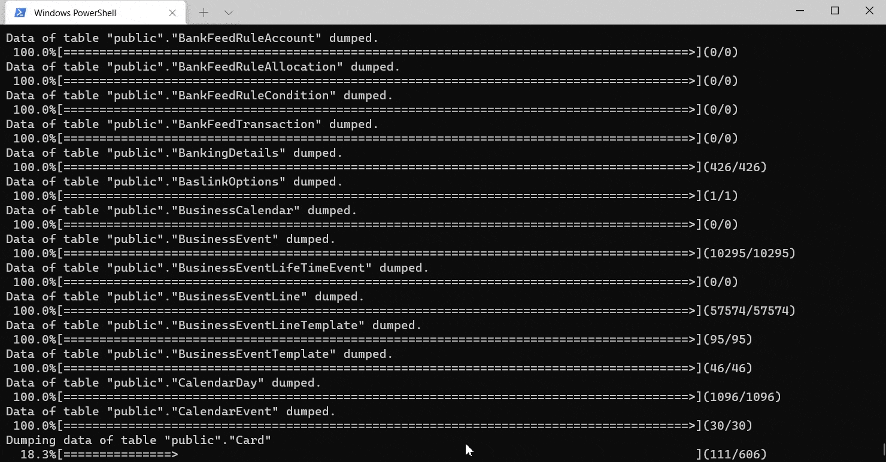

# <p align="center">CHANGEDB</p>
<p align="center">ChangeDB is a multi-database cli convert tool, it's all about making database migration much more easier. </p>

<p align="center">

<a href="https://img.shields.io/nuget/v/ChangeDB.ConsoleApp">
    
</a>
<a href="https://github.com/yscorecore/changedb/blob/master/LICENSE">
    
</a>
<a href="https://codecov.io/gh/yscorecore/changedb">
    
</a>
<a href="https://sonarcloud.io/summary/new_code?id=yscorecore_changedb">
    
</a>

</p>

## 📕 How to use
1. Install Dotnet (net5/net6):   
`ChangeDB` is supported by dotnet SDK, please check the link [Here](https://dotnet.microsoft.com/download/dotnet) to set up your dotnet SDK.
2. Install `ChangeDB`:  
Follow the command below to set up the tool quite easily.
   ```shell
   dotnet tool install ChangeDB.ConsoleApp -g
   ``` 
3. Convert Database:   
`changedb migration` is the command to migrate the database. Like the example command below, you need to provide the source database type, source database connection string, target database type, and target database connection string to establish migrate task. and for the target database, `changedb` can create a new target database even if not exists. so you don't create an empty database every time first. 
    ```shell
   changedb migration {source-database-type} "{source-connection-string}" {target-database-type} "{target-connection-string}" 
   ```
4. Dump database to sql scripts:  
 `changedb dumpsql` is the command to generate a dump file, the example below to create SQL scripts.
   ```shell
   changedb dumpsql {source-database-type} "{source-connection-string}" {target-database-type} "{output-file}" 
   ```
5. Here we use  [Northwind.sql](https://github.com/Microsoft/sql-server-samples/tree/master/samples/databases/northwind-pubs) as source data to show how `ChangeDB` migrate between different types of database   
<p align="center">


## 📦 Supported Database 

 - **Sql Server**
 - **Postgres**
 - **Mysql**
 - **Firebird**
 - **Sql Server Compact** (only supported in windows)

## 🏗️Architecture diagram

<p align="center">


## 🔗Database Formate Connection String 

|Database | Format connection string  | Extend usages | 
|---|---|---|
|Sql Server| `Server=myServerAddress;Database=myDataBase;User Id=myUsername;Password=myPassword;` |[Link](https://www.connectionstrings.com/microsoft-data-sqlclient/) |
|Postgres| `Server=127.0.0.1;Port=5432;Database=myDataBase;User Id=myUsername;Password=myPassword;` |[Link](https://www.connectionstrings.com/npgsql/) |
|Mysql| `Server=myServerAddress;Database=myDataBase;Uid=myUsername;Pwd=myPassword;` |[Link](https://www.connectionstrings.com/mysql-connector-net-mysqlconnection/) |
|Firebird| `User=SYSDBA;Password=masterkey;Database=SampleDatabase.fdb;DataSource=localhost;Port=3050;Dialect=3;Charset=NONE;Role=;Connection lifetime=15;Pooling=true;MinPoolSize=0;MaxPoolSize=50;Packet Size=8192;ServerType=0;` |[Link](https://www.connectionstrings.com/firebird/) |
|Sql Server Compact| `Data Source=MyData.sdf;Persist Security Info=False;` |[Link](https://www.connectionstrings.com/sqlserverce-sqlceconnection/)|
    
## 🧩Database Object Supported
| Category | Object | Sql Server| Postgres| Mysql | Sql Server Compact |
|---|---|---|---|---|---|
| Table|`identity`|✔️|✔️|✔️|✔️|
| Table|`index`|✔️|✔️|✔️|✔️|
| Table|`unique`|✔️|✔️|✔️|✔️|
| Table|`default constant value`|✔️|✔️|✔️|✔️|
| Table|`default function value`|✔️(`newid`,`getdate`)|✔️(`gen_random_uuid`,`now`)|✔️(`uuid`,`now`)|✔️(`newid`,`getdate`)|
| Table|`foreign key`|✔️|✔️|✔️|✔️|
| Table|`unique index`|✔️|✔️|✔️|✔️|
